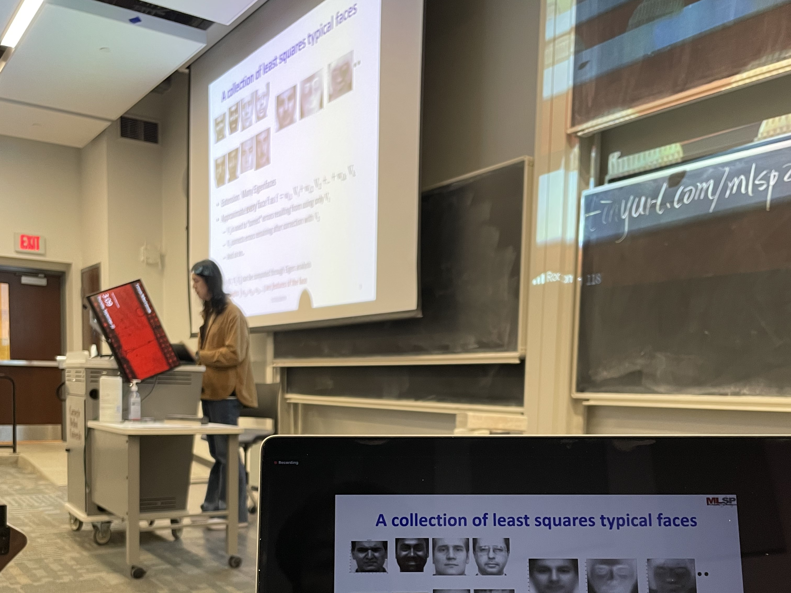

<html lang="en">
<head>
	<meta charset="UTF-8">
	<title>[Project Name] Project Timeline</title>
	<link rel="stylesheet" type="text/css" href="timeline.css" media="all" />
</head>
<body>
    <ol class="timeline">
         
         
        <li class="tl-node">
			
August, 2022 - Now

			
Research on AI jazz improvisation tutoring

		</li>
         
        <li class="tl-node">
            
August, 2022 - Now

            
Teaching assistant: <i>Machine Learning for Siganl Processing</i>

            
            
Me giving a lecture about face detection, October 2022

        </li>
         
        <li class="tl-node">
			
May - August, 2022

			
Internship at TikTok SAMI

		</li>
         
        <li class="tl-node">
			
January - May, 2022

			
Participate in <i>AI Song Contest 2022</i>

            
            
Speaking at AISC Ceremony, June 2022

		</li>
         
        <li class="tl-node">
			
January - May, 2022

			
Course project: Timbre transfer with flexible timbre control (Paper under review)

		</li>
         
        <li class="tl-node">
			
November, 2021 - Now

			
Research on expressive performance synthesis

		</li>
         
        <li class="tl-node">
			
September, 2021 - Janurary, 2022

			
Course project: Speech anonymization with pseudo VC (Interspeech 2022)

            <a href="https://arxiv.org/abs/2209.04530">Arxiv Link</a>
            
            
Presentation and project poster, December 2021

		</li>
         
        
August, 2021

        
Entered Cargenie Mellon

    </ol>
      
    <ol class="timeline">
        
June, 2021

        
B.Eng in Information Engineering

        
        
In the studio, recording for the graduation gala, June 2021

        <li class="tl-node">
            
September, 2020 - June, 2021

            
Bachelor thesis on speech synthesis tool

        </li>
         
        <li class="tl-node">
            
July, 2020 - July, 2021

            
Internship at ByteDance AI-Lab SA

        </li>
         
        <li class="tl-node">
			
September, 2019 - August, 2020

			
Research on vocal register recognition at LAMT, Fudan University

		</li>
         
        <li class="tl-node">
			
July-August, 2019

			
Summer school at UC Berkeley, taking the course <i>Sound and Music Computing</i>

            
My project <i>Project Ming</i> won the 2nd place at the CSMT 2020 Exhibition.

            
            
Presenting <i>Project Ming</i> at CSMT, November 2020

		</li>
         
        
September, 2017

        
Entered Shanghai Jiao Tong University

    </ol>
</body>
</html>
