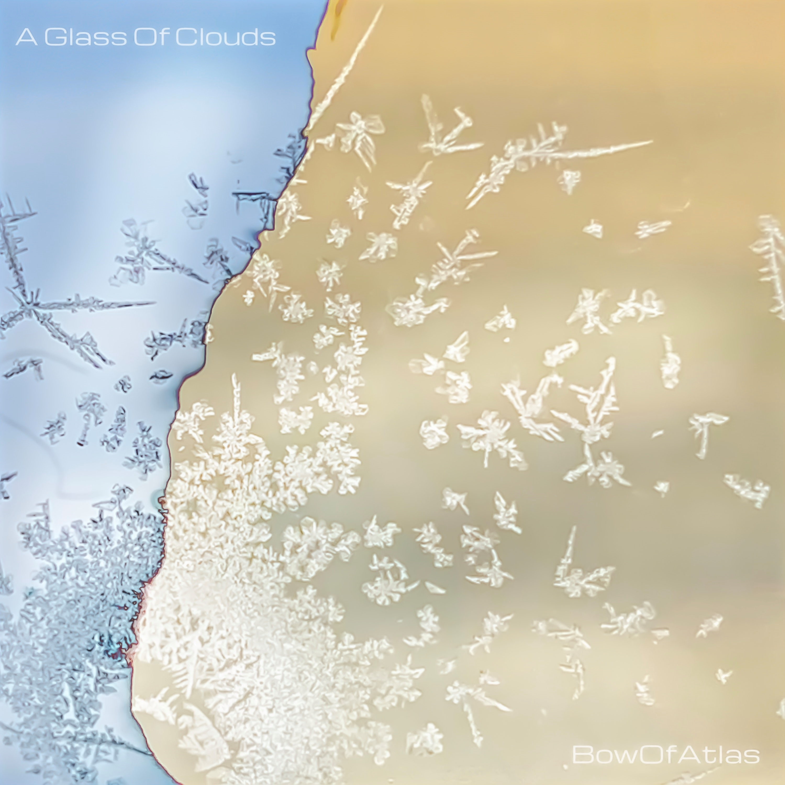
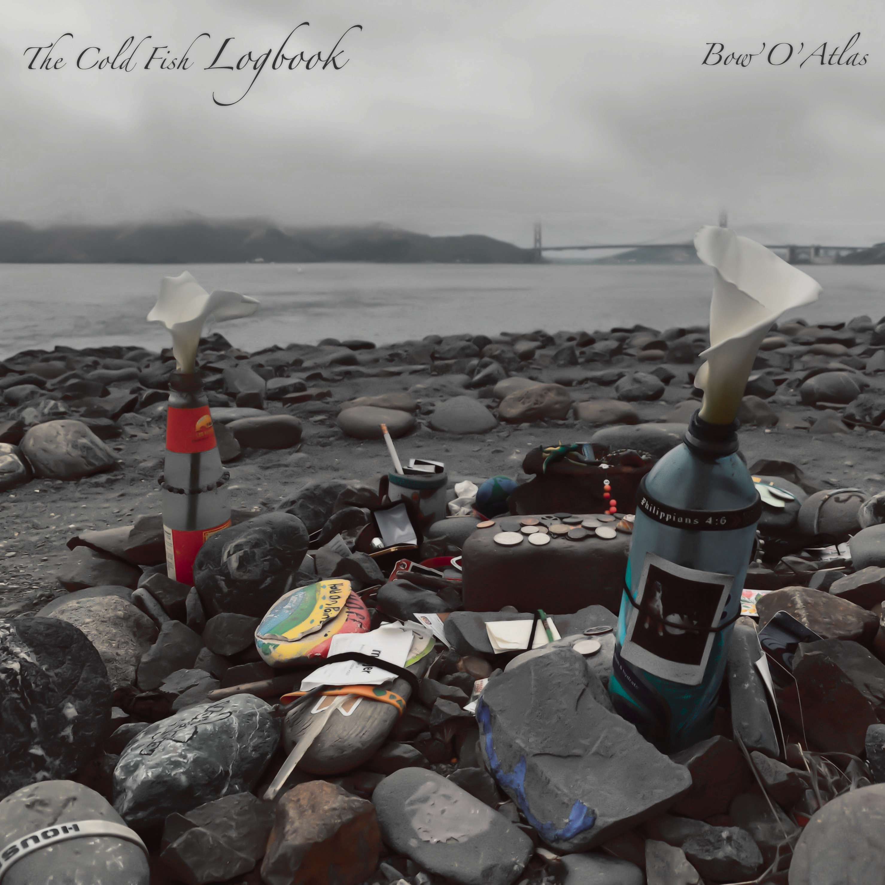

## AI Song Contest 2022

Our team ***3+i*** participated in AI Song Contest 2022 with our music ***A to I***.  
Team members include:
- Yusong Wu (from UdeM)
- Yi Deng (from NYU)
- Myself

<iframe width="100%" height="166" scrolling="no" frameborder="no" allow="autoplay"
    src="https://w.soundcloud.com/player/?url=https%3A//api.soundcloud.com/tracks/1279199113&color=ff5500"></iframe>

    <a href="https://soundcloud.com/3-plus-i" title="3+i" target="_blank"
        style="color: #cccccc; text-decoration: none;">3+i</a> · <a href="https://soundcloud.com/3-plus-i/a-to-i"
        title="A to I - AI Song Contest 2022" target="_blank" style="color: #cccccc; text-decoration: none;">A to I - AI
        Song Contest 2022</a>

We made it to the final list and received the **3rd prize** in the end!  
Learn more about our human-AI interation process in creating this song at our [**team page**](https://www.aisongcontest.com/participants-2022/3i)!

## Music for SJTU
During my undergrad years (2017-2021), I wrote several songs for school galas as a musician of **SJTU Art Center**.

- [Follow our podcast at NetEase Cloud Music!](http://music.163.com/radio?id=526839633)

## BowOfAtlas
I publish music in the name of *BowOfAtlas* starting from 2014.
- [Spotify Page](https://open.spotify.com/artist/7u6TOEKFO20LfGibgidFRV?si=44gD6Im0Tai8xL1sFXrRVw&utm_source=copy-link)
- [Apple Music Page](https://music.apple.com/us/artist/bowofatlas/1474860092)
- [QQ Music Page](https://c.y.qq.com/base/fcgi-bin/u?__=kyfI2cIedHE3)
- [NetEase Music Page](https://music.163.com/#/artist?id=1131005)

Recent Mini Albums:
<table>
    <tr>
        <td></td>
        <td></td>
    </tr>
    <tr>
        <td></td>
        <td></td>
    </tr>
</table>

