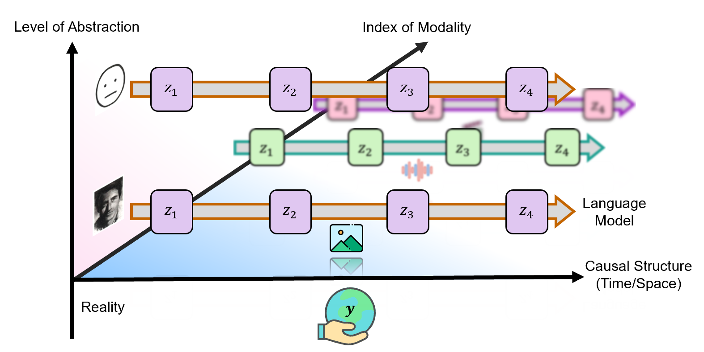

<!-- 
<head>
  <meta charset="utf-8">
  <link rel="stylesheet" href="card.css" media="all">
</head> -->

<!-- # Research   -->

My research investigates how structured abstractions arise and organize themselves within learning systems. Human-like intelligence is supported by multiple languages of thought (LoT) like below, from different perceptual modalities (y-axis) and different levels of abstraction (z-axis).

(Natural language is not shown here, as it is a System-2 conglomeration of all.)

My research is circled around the questions of:
- How structured abstract representations can emerge from lower-level signals under principled inductive biases, a.k.a. **emergent language** on the higher z-axis;
- How heterogeneous representations can be aligned at the function/model level for coordinated understanding, reasoning and generation, a.k.a. **function alignment** across different models.

These questions are closely related to the broader topic of **self-supervised learning**, **hierarchical modeling**, **designed interpretability** and **neural-symbolic integration**. I am also interested in **audio/music AI** and **multimodality** as testbeds and application.

## Publications

- **Bridging Perceptual and Analytic Dynamics via Function Alignment**  
**Yuxuan Wu**, Gus Xia  
ICLR 2026 Re-Align Workshop  
[Paper](https://openreview.net/forum?id=TuuyJZrDm5) · [Code (TBD)](#)

- **Emergence of Symbolic Language from Perception through Physical Symmetry**  
Xuanjie Liu*, **Yuxuan Wu***, Ziyu Wang, Gus Xia  
Under Review  
[Paper (TBD)](#) · [Code (TBD)](#)

- **Unsupervised Disentanglement of Content and Style via Variance-Invariance Constraints**  
**Yuxuan Wu**, Ziyu Wang, Bhiksha Raj, Gus Xia  
ICLR 2025  
[Paper](https://arxiv.org/pdf/2407.03824) · [Code](https://github.com/Irislucent/variance-versus-invariance) · [Demo](https://v3-content-style.github.io/V3-demo/)

- **Automatic Melody Reduction via Shortest Path Finding**  
Ziyu Wang, **Yuxuan Wu**, Gus Xia, Roger B. Dannenberg  
ISMIR 2025  
[Paper](https://arxiv.org/pdf/2508.01571) · [Demo](https://auto-melody-reduction.github.io/AMRA-demo/)

- **A Closer Look at Reinforcement Learning-based Automatic Speech Recognition**  
Fan Yang, Muqiao Yang, Xiang Li, **Yuxuan Wu**, Zhiyuan Zhao, Bhiksha Raj, Rita Singh  
Computer Speech and Language, 2024  
[Paper](https://www.sciencedirect.com/science/article/abs/pii/S088523082400024X)

- **Motif-Centric Representation Learning for Symbolic Music**  
**Yuxuan Wu**, Roger B. Dannenberg, Gus Xia  
arXiv 2023  
[Paper](https://arxiv.org/abs/2309.10597) · [Code](https://github.com/Irislucent/motif-encoder)

- **TransPlayer: Timbre Style Transfer with Flexible Timbre Control**  
**Yuxuan Wu**, Yifan He, Xinlu Liu, Yi Wang, Roger B. Dannenberg  
ICASSP 2023 (Oral)  
[Paper](https://ieeexplore.ieee.org/abstract/document/10096233/) · [Code](https://github.com/Irislucent/TransPlayer) · [Demo](https://irislucent.github.io/TransPlayer-demos/)

- **SingStyle111: A Multilingual Singing Dataset with Style Transfer**  
Shuqi Dai, Siqi Chen, **Yuxuan Wu**, Ruxin Diao, Roy Huang, Roger B. Dannenberg  
ISMIR 2023  
[Paper](http://www.cs.cmu.edu/afs/cs.cmu.edu/Web/People/rbd/papers/singstyle2023.pdf) · [Demo](https://dsqvival.github.io/singstyle111/#abus)

- **DeID-VC: Speaker De-identification via Zero-shot Pseudo Voice Conversion**  
Ruibin Yuan, **Yuxuan Wu**, Jacob Li, Jaxter Kim  
INTERSPEECH 2022  
[Paper](https://arxiv.org/pdf/2209.04530) · [Code](https://github.com/a43992899/DeID-VC)

- **A Method for Music Texture Generation Based on Markov Chains**  
Xia Liang, Yuan Wan, **Yuxuan Wu**, Bilei Zhu, Zejun Ma  
China Patent, 2022

## Invited Talks

- **Emergent Language of Thought in AI: The Birth of Symbols & The Rise of Structure**  
Institute for Math & AI, Wuhan University — December 2025

- **Music Through the Lens of Machine and Intelligence**  
Chengdu University — July 2025

- **Introduction to Music AI: Programmer’s Perspective and Machine Composition**  
Nanjing University of the Arts — May 2025

- **Emergent Content-Style Disentanglement via Variance-Invariance Constraints**  
Sound & Music Computing Lab, National University of Singapore — April 2025

- **A Glimpse into Self-Supervised Music Concept Discovery**  
Nanjing University of the Arts — June 2024

- **A to I: Music Cocreation with AI**  
Music AI Group, Mila – Quebec AI Institute — February 2023

<!-- --- -->

## Teaching

I have served as a teaching assistant in undergraduate and graduate courses spanning artificial intelligence, machine learning, interpretability, and music AI. I value helping students move beyond implementation toward structural understanding of the landscape of AI and its connections to humanity and life.

**MBZUAI (Teaching Assistant and Course Co-Design)**  
- AI1010 — Introduction to AI (First undergraduate cohort)  
- ML8506 — Interpretable AI (First offering)  
- ML711 — Intermediate Music AI (First offering)  
- ML801 — Foundations and Advanced Topics in Machine Learning  

**Carnegie Mellon University (Teaching Assistant)**  
- 11-755 / 18-797 — Machine Learning for Signal Processing  
- 15-322 / 15-622 — Introduction to Computer Mus